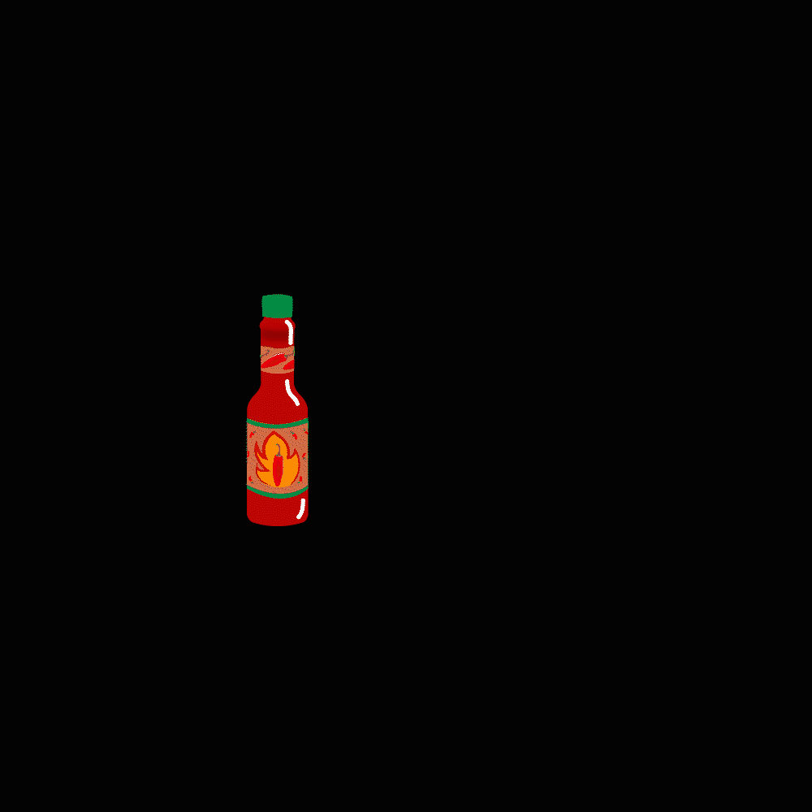

🐔# 🐔 El Pollo Loco

[](LICENSE)


A small **HTML5/Canvas-based platformer game** built with **Vanilla JavaScript (ES6+)**, using a clean modular architecture with services for **state management, asset handling, and a central game loop**.

---

## 🎮 Preview

> _(Insert a GIF or screenshot here once gameplay is stable)_  



---

## 🚀 Quickstart

```bash
# Clone the repo
git clone https://github.com/<your-org>/el-pollo-loco.git
cd el-pollo-loco

# Start a local web server (example with serve)
npx serve .


<!-- ------------ DEV DOKU ------------ -->

StateMachine – So benutzt du sie

1.  Neue Figur erstellen
    • Lege in models/ eine neue Klasse an
    • Definiere ein SPRITES-Objekt mit allen States

    const SPRITES = {
    idle: ["assets/img/boss/idle/idle1.png", "assets/img/boss/idle/idle2.png"],
    attack: ["assets/img/boss/attack/attack1.png", "assets/img/boss/attack/attack2.png"],
    dead: ["assets/img/boss/dead/dead1.png"],
    };

2. StateMachine instanzieren

this.stateMachine = new StateMachine(SPRITES, "idle", 8);
this.loadImage(SPRITES.idle[0]);
this.stateMachine.preload((path) => this.loadImage(path));

3. Animation aktivieren

setInterval(() => {
  const path = this.stateMachine.getNextFrame();
  if (path && this.imageCache[path]) {
    this.img = this.imageCache[path];
  }
}, 1000 / this.stateMachine.frameRate);

4. Zum Wechseln des States den State-Namen setzen:

this.stateMachine.setState("attack");